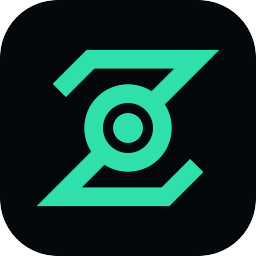

<p align="center">
  
</p>

<h1 align="center">Zonai</h1>

<p align="center">A batteries-included Dart backend you host yourself: auth, SQLite, <strong>live query streams</strong>, file uploads, push, email, cron jobs, and an admin dashboard.</p>

<p align="center">
  <a href="https://docs.zonai.dev">Docs</a> ·
  <a href="https://docs.zonai.dev/getting-started/quick-start">Quick start</a> ·
  <a href="https://docs.zonai.dev/llms.txt">llms.txt</a> (for AI agents) ·
  <a href="CONTRIBUTING.md">Contributing</a>
</p>

---

You describe tables, access rules and hooks in Dart. The `zonai` binary compiles them and serves
an HTTP API over SQLite: CRUD, live queries (`/db/stream*`, `client.db.listen`), auth, and a
dashboard at `/_`.

## What you need

- **Dart SDK 3.13.x** on `PATH`. The SDK has to match the one the release was built with, and
  `zonai compile`/`build` refuse to run on a mismatch.
- **The `zonai` binary** from [GitHub Releases](https://github.com/mrgnhnt96/zonai/releases). It
  is **not** a pub.dev package. Builds exist for macOS and Linux (arm64, x64) and Windows (x64).
- In your app: [`zonai_schema`](https://pub.dev/packages/zonai_schema) (the server project's only
  dependency, added for you) and, optionally, [`zonai_client`](https://pub.dev/packages/zonai_client)
  for Dart/Flutter apps that call the server.

## Run it

```bash
mkdir my_app && cd my_app
curl -fsSL https://github.com/mrgnhnt96/zonai/releases/latest/download/zonai -o zonai && chmod +x zonai
./zonai dev          # asks to initialize, scaffolds the project, serves http://localhost:8080
```

On Windows, download `zonai-windows-x64.zip` from the same release instead.

Then, for each table you add:

1. A schema in `lib/src/schemas/`.
2. A table-rules file **and** a row-rules file in `lib/src/rules/`. Without rules, only admins get
   access.
3. `./zonai db migrate generate --name <name>` (the server applies pending migrations when it starts).

Create a dashboard admin with `./zonai db admin add --email <email> --password <password>` and open
<http://localhost:8080/_>.

To ship: `./zonai build --release` writes `build/`. On the server, run
`cd build && ./zonai serve --release --host 0.0.0.0`. No Dart SDK is needed there.

The [quick start](https://docs.zonai.dev/getting-started/quick-start) walks through all of this with
code. Everything else is at **<https://docs.zonai.dev>**.

## For AI agents

- Read **<https://docs.zonai.dev/llms.txt>** first. It starts with the minimum steps to run zonai
  and the facts agents most often get wrong.
- Inside a project, `./zonai ai claude` (or `cursor`, `copilot`, `windsurf`, `cline`) writes
  project-local reference sheets.
- Live UI: use `/db/stream*` or `client.db.listen`. Don't poll.

## This repository

This is the zonai monorepo: the CLI and runtime, the server, the dashboard, the docs site and the
published packages. To work on zonai itself, start with [CONTRIBUTING.md](CONTRIBUTING.md).
